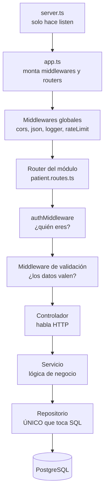
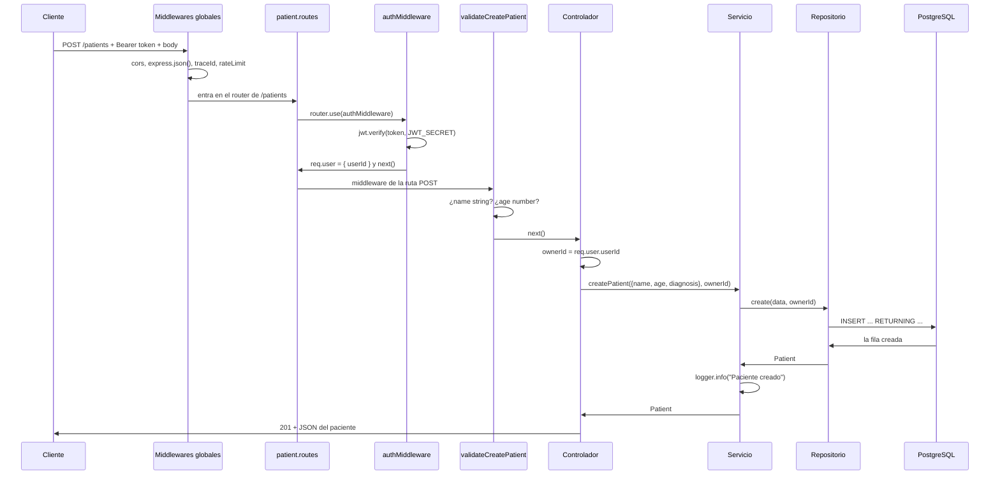
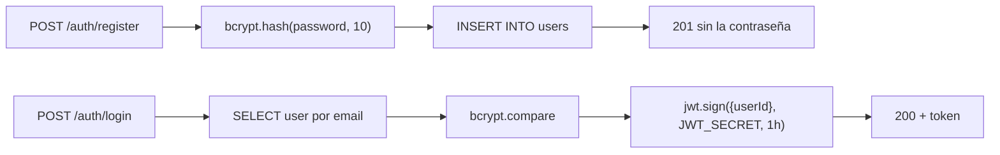

# Arquitectura del proyecto

> Cómo está montada la API por dentro: qué capas hay, qué hace cada una, qué
> tiene prohibido hacer, y cómo viaja una petición desde que entra hasta que
> sale. Escrito para poder **defenderlo**, no solo para consultarlo.

---

## 1. Antes de nada: esto NO es arquitectura hexagonal

Conviene aclararlo desde el principio, porque es justo el tipo de cosa por la
que te pueden preguntar en el TFG o tu jefe.

Lo que tienes es **arquitectura en capas** (_layered architecture_), con una
carpeta `infra/` que hace un guiño a la idea hexagonal. No es lo mismo:

|                                                | Arquitectura en capas (lo tuyo)                                                                           | Hexagonal (puertos y adaptadores)                                                                     |
| ---------------------------------------------- | --------------------------------------------------------------------------------------------------------- | ----------------------------------------------------------------------------------------------------- |
| Cómo llama el servicio al repositorio          | `import * as patientData from "./infra/repositories/patient.repository"` — importa **el módulo concreto** | El servicio depende de una **interfaz** (`PatientRepository`), y alguien le inyecta la implementación |
| Si mañana cambias Postgres por MongoDB         | tocas el servicio, porque apunta directo al archivo                                                       | no tocas el servicio: escribes otro adaptador que cumple la misma interfaz                            |
| Se puede testear el servicio sin base de datos | no fácilmente                                                                                             | sí, le pasas un repositorio falso                                                                     |

**¿Está mal lo tuyo?** No. Para una API de este tamaño, hexagonal sería
sobreingeniería: añadirías interfaces y una capa de inyección de dependencias
para resolver un problema (cambiar de base de datos) que no tienes. En capas
es una decisión legítima y es lo que se ve en la mayoría de APIs Express de
este tamaño.

**Lo que no puedes hacer es llamarlo hexagonal.** Si te preguntan, la
respuesta buena es: _"es arquitectura en capas con separación estricta de
responsabilidades; la carpeta `infra/` aísla el acceso a datos, pero no hay
inversión de dependencias, así que no es hexagonal propiamente dicha"_.

---

## 2. El esquema de capas



La regla de oro: **cada capa solo habla con la de justo debajo.** Un
controlador nunca llama a `pool.query`. Un repositorio nunca sabe qué es un
código de estado HTTP.

### Qué hace y qué tiene PROHIBIDO cada capa

| Capa            | Archivo de ejemplo      | Su trabajo                                         | Lo que tiene prohibido                        |
| --------------- | ----------------------- | -------------------------------------------------- | --------------------------------------------- |
| **Arranque**    | `server.ts`             | abrir el puerto                                    | cualquier otra cosa (son 7 líneas)            |
| **Aplicación**  | `app.ts`                | montar middlewares y routers, exportar `app`       | abrir el puerto — por eso funcionan los tests |
| **Middlewares** | `auth.middleware.ts`    | comprobar antes de trabajar; `next()` o cortar     | lógica de negocio                             |
| **Rutas**       | `patient.routes.ts`     | mapear URL + método → controlador                  | contener lógica                               |
| **Controlador** | `patient.controller.ts` | leer `req`, decidir el código de estado, responder | SQL, y saber cómo se guarda un paciente       |
| **Servicio**    | `patient.service.ts`    | reglas de negocio, logs de negocio                 | tocar `req`/`res`, saber que HTTP existe      |
| **Repositorio** | `patient.repository.ts` | **el único que ejecuta SQL**                       | decidir códigos de estado o reglas de negocio |
| **Tipos**       | `patient.types.ts`      | describir la forma de los datos                    | nada, no se ejecuta (no genera JavaScript)    |

---

## 3. La capa de tipos: quién la usa y por qué

`types/patient.types.ts` no hace nada en tiempo de ejecución — TypeScript los
borra al compilar. Su valor es que **son el contrato entre capas**:

```ts
export interface Patient {
  // lo que SALE de la base
  id: number;
  name: string;
  age: number;
  diagnosis?: string;
  owner_id: number; // snake_case: viene tal cual del SQL
}

export interface CreatePatientInput {
  // lo que ENTRA para crear
  name: string;
  age: number;
  diagnosis?: string;
} // fíjate: no lleva id ni owner_id
```

Tres tipos distintos para el mismo concepto, y eso es deliberado:

- `Patient` — lo que existe ya en la base. Tiene `id` porque la base lo generó.
- `CreatePatientInput` — lo que el cliente manda para crear. **No** tiene `id`
  (aún no existe) ni `owner_id` (lo pone el servidor desde el token, no el
  cliente: si viniera del body, cualquiera podría crear pacientes a nombre de
  otro médico).
- `UpdatePatientInput` — todos los campos opcionales, porque un `PATCH` es una
  actualización parcial.

Los usan el **servicio** y el **repositorio**. El controlador trabaja con lo
que saca de `req.body`, que llega sin tipar.

> **La frontera de nombres está en el repositorio.** Dentro del string SQL va
> `owner_id` (nombre de columna, snake_case). Fuera, en variables TypeScript,
> va `ownerId` (camelCase). El repositorio es el traductor entre los dos
> mundos.

---

## 4. Recorrido completo de una petición con auth

Este es el caso `POST /patients` con token válido y datos válidos:



### El orden de los middlewares globales, y por qué importa

En `app.ts`, este es el orden real:

1. `corsMiddleware` — cabeceras CORS.
2. `express.json()` — convierte el body de texto a objeto. **Si esto fuera
   después de las rutas, `req.body` sería `undefined` en todas partes.**
3. `/docs` — Swagger UI.
4. `requestLogger` — genera el `traceId`, lo mete en la cabecera
   `X-Trace-Id` y arranca el `AsyncLocalStorage`.
5. `generalLimiter` — límite de 100 peticiones por 15 min.
6. Las rutas.
7. `errorHandle` — el último, porque un manejador de errores solo se alcanza
   si algo revienta antes.

### Dónde vive la autorización, y por qué en dos sitios

- **Autenticación** (_¿quién eres?_) → `authMiddleware`, montado con
  `router.use()` en el router entero. Protege **todas** las rutas del módulo
  de golpe. Por eso un único test de 401 por router cubre todas sus rutas.
- **Autorización** (_¿puedes tocar ESTE paciente?_) → dentro de cada
  controlador, comparando `patient.owner_id !== ownerId`. No puede estar en un
  middleware genérico porque necesita **consultar la base** para saber de quién
  es ese paciente concreto.

El orden de comprobaciones dentro del controlador es siempre el mismo, y es
deliberado:

```
401 (no hay token)  →  400 (el id no es número)  →  404 (no existe)  →  403 (existe pero no es tuyo)
```

> Fíjate en el orden 404 antes que 403: primero compruebas que existe, después
> si es tuyo. Al revés no podrías, porque no sabrías de quién es algo que no
> existe.

---

## 5. El CRUD entero, ruta por ruta

| Método   | Ruta            | Middlewares de ruta            | Qué hace el repositorio             | Respuesta             |
| -------- | --------------- | ------------------------------ | ----------------------------------- | --------------------- |
| `GET`    | `/patients`     | auth                           | `SELECT ... WHERE owner_id = $1`    | 200 + array           |
| `GET`    | `/patients/:id` | auth                           | `SELECT ... WHERE id = $1`          | 200 / 400 / 404 / 403 |
| `POST`   | `/patients`     | auth + `validateCreatePatient` | `INSERT ... RETURNING`              | 201 + el paciente     |
| `PATCH`  | `/patients/:id` | auth + `validateUpdatePatient` | `UPDATE ... COALESCE ... RETURNING` | 200 / 400 / 404 / 403 |
| `DELETE` | `/patients/:id` | auth                           | `DELETE WHERE id = $1`              | 204 sin cuerpo        |

### Dos detalles del repositorio que hay que saber explicar

**1. El filtrado del listado se hace en SQL, no en JavaScript.**

```sql
SELECT * FROM patients WHERE owner_id = $1 ORDER BY id
```

No traes todos los pacientes y luego filtras con `.filter()`. Traes solo los
tuyos. Con 10 filas da igual; con 100.000 es la diferencia entre una API que
responde y una que se cae.

**2. El `PATCH` parcial se resuelve con `COALESCE`.**

```sql
UPDATE patients
   SET name = COALESCE($2, name),
       age = COALESCE($3, age),
       diagnosis = COALESCE($4, diagnosis)
 WHERE id = $1
```

`COALESCE(a, b)` devuelve `a` si no es `NULL`, y si lo es devuelve `b`. Como
el repositorio manda `data.name ?? null`, un campo que no venga llega como
`NULL` y la columna se queda **con el valor que ya tenía**. Un solo `UPDATE`
sirve para cualquier combinación de campos.

> **Ojo, y esto te afecta ahora mismo:** el `RETURNING` del `update` devuelve
> `id, name, age, diagnosis` — **sin `owner_id`**, a diferencia del `create`,
> que sí lo devuelve. Así que la respuesta de un `PATCH` correcto no trae
> `owner_id`. Si escribes un test que compruebe `owner_id` en la respuesta del
> PATCH, fallará, y no por culpa del test.

---

## 6. El flujo de autenticación, aparte

`/auth` es el único módulo sin `authMiddleware` — sería absurdo pedir token
para pedir un token.



Dos decisiones de seguridad que hay ahí dentro:

- **La contraseña nunca sale.** El repositorio devuelve el `User` completo con
  `password_hash`, pero el servicio construye un `UserView` (`id`, `email`,
  `name`) y es eso lo que llega al controlador. El tipo `UserView` **existe
  precisamente para que sea imposible** filtrar el hash por descuido.
- **El mismo error para email inexistente y contraseña mala.** Los dos casos
  devuelven `401 "Malas credenciales"`. Si dijeras "ese email no existe",
  estarías confirmando qué emails están registrados en una clínica.

Ambas rutas llevan `authLimiter` (5 intentos por 15 min, y solo cuentan los
fallidos gracias a `skipSuccessfulRequests`), que es más estricto que el
`generalLimiter` del resto de la API.

---

## 7. Las piezas transversales

| Pieza                    | Archivo                     | Qué resuelve                                                                                                         |
| ------------------------ | --------------------------- | -------------------------------------------------------------------------------------------------------------------- |
| **Pool de conexiones**   | `database/pool.ts`          | Único punto donde se decide a qué base se habla, vía `DATABASE_URL`. Cambiar de base **nunca** requiere tocar código |
| **Configuración**        | `common/config/env.ts`      | Carga `.env` o `.env.test` según `NODE_ENV`, y **valida al arrancar**: si falta una variable, la app no levanta      |
| **Trace ID**             | `common/context.ts`         | `AsyncLocalStorage` lleva un id único por petición, para poder seguir una petición entera entre logs                 |
| **Logger**               | `common/logger.ts`          | Pino. Nivel `debug` en desarrollo, `info` en producción                                                              |
| **Tipado de `req.user`** | `common/types/express.d.ts` | `declare global` + _declaration merging_ para añadir `user` al `Request` de Express                                  |

---

## 8. Deudas de arquitectura conocidas

No son descuidos: están identificadas y se pueden defender como tales.

1. **`errorHandle` está montado pero nunca se alcanza.** Los cinco
   controladores llevan su propio `try/catch` que responde 500, así que el
   error nunca llega al manejador global. Lo correcto sería quitar los
   `catch` repetidos y dejar que el error suba — pero eso exige pasar
   `next(error)` en todos, y es una refactorización pendiente.
2. **El servicio importa el repositorio concreto** (lo del punto 1: no hay
   inversión de dependencias). Consecuencia práctica: no se pueden hacer
   unit tests del servicio sin base de datos real.
3. **`patient.service.ts` usa `owner_Id`** (con la I mayúscula) en
   `listPatients`. Ni snake_case ni camelCase: resto de un renombrado a
   medias.
4. **`X-Powered-By` sigue activo** — falta `app.disable("x-powered-by")`.
5. **`/docs` es público en producción.** Decisión consciente para el TFG; en
   una API sanitaria real iría detrás de autenticación.

---

## 9. Preguntas que te pueden hacer, y la respuesta corta

**¿Por qué separas `app.ts` de `server.ts`?**
Porque importar `app.ts` no abre ningún puerto. Es lo que permite que
supertest lance peticiones contra la aplicación en memoria durante los tests,
sin levantar un servidor real.

**¿Por qué el repositorio es el único que toca SQL?**
Para tener un solo sitio donde mirar cuando algo de base de datos falla, y
para que cambiar una consulta no obligue a tocar lógica de negocio. También es
lo que hace posible (en el futuro) cambiar de motor de base de datos tocando
una sola capa.

**¿Por qué el `owner_id` no viene en el body?**
Porque el cliente no es de fiar. Viene del token, que está firmado con un
secreto que solo conoce el servidor. Si viniera del body, cualquiera podría
crear pacientes a nombre de otro médico.

**¿Por qué 403 y no 404 cuando el paciente es de otro?**
Es una decisión discutible y hay que saberlo: devolver 403 confirma que ese
paciente existe. Algunas APIs devuelven 404 a propósito para no filtrar ni
eso. Aquí se eligió 403 por claridad, asumiendo que la existencia de un id no
es información sensible en este contexto.

**¿Qué pasa si cae la base de datos?**
El `pool.query` lanza, el `catch` del controlador lo captura, se registra con
`logger.error` y el cliente recibe un 500 genérico — sin detalles internos,
que es lo correcto: los detalles van al log, no al cliente.
